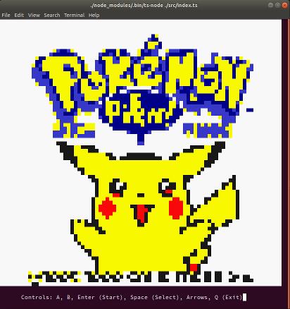

TS-GB Web
===

In-terminal Game Boy emulator using [`ts-gb`](https://github.com/Lyrkan/ts-gb/).

*Yes, it's slow.*

```
$ git clone git@github.com:Lyrkan/ts-gb-terminal.git
$ cd ts-gb-terminal
$ yarn
$ yarn start <rom>
```

